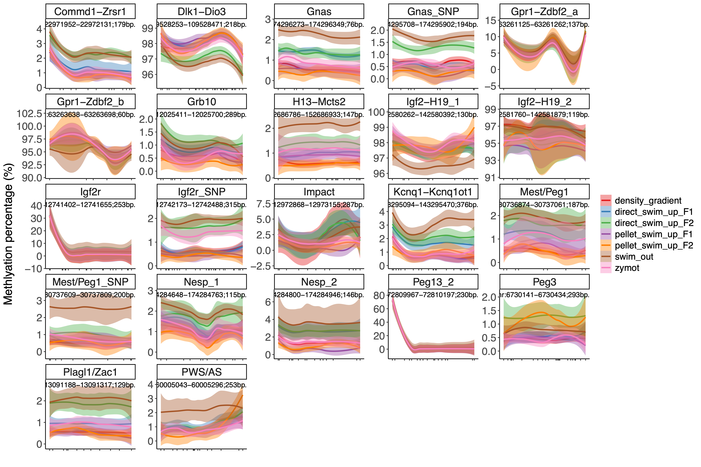

# AmpliconSeq_pipeline 

Amplicon-seq is a targeted sequencing method that enables high-throughput analysis of specific genomic regions, commonly used to assess genetic variation or DNA methylation at predefined loci. This repository provides a minimal, exemplar pipeline for processing bisulfite amplicon-seq FASTQ files (via shell script) and performing downstream methylation analysis (via R).

## Contents
- run_amplicon.sh — Bash script to process raw FASTQ files using trim_galore and bismark, producing .cov.gz methylation reports.
- ampliconseq_analysis.Rmd — R Markdown script for downstream QC and exploratory analysis (e.g., methylation distribution, PCA, gene-level plots).
- ampliconseq_analysis.html — Rendered HTML version of the R analysis.
- cpg_gene_plot.pdf — Example figure generated during the analysis.


## Requirements
	trim_galore
	bismark (with Bowtie2)
	samtools
	R with the following packages:
	- edgeR, ggplot2, pheatmap, tidyverse, plotly, ggfortify, etc.

See the .Rmd file for package usage.

## Usage

1.	Preprocessing:

Run the following command to generate methylation coverage files (.cov.gz) using Bismark:
```
bash run_amplicon.sh sample.R1.fq.gz sample.R2.fq.gz /path/to/bismark_index &
```
This will produce .cov.gz files in the current directory and log detailed command & execution in sample.log.

2.	Analysis in R:

Open or knit ampliconseq_analysis.Rmd in RStudio or via command line to generate the HTML report:

```
rmarkdown::render("ampliconseq_analysis.Rmd")
```
## Preprocessing Logging

Each major processing step is logged to a file with command and execution details (sampleX.log).

A test example:
```
Amplicon-seq pipeline started at 2025-06-04 13:06:41
Sample: SRR17518177 | Mode: paired-end | Dry-run: true
==========================================

----------------------------------------------------------------------------------------------------
                                       STAGE 1: FastQC
----------------------------------------------------------------------------------------------------
>> fastqc SRR17518177.R1.fq.gz SRR17518177.R2.fq.gz

----------------------------------------------------------------------------------------------------
                                       STAGE 2: Trim Galore
----------------------------------------------------------------------------------------------------
>> trim_galore --paired SRR17518177.R1.fq.gz SRR17518177.R2.fq.gz

----------------------------------------------------------------------------------------------------
                                       STAGE 3: Bismark Alignment
----------------------------------------------------------------------------------------------------
>> bismark --genome /Users/dale/genomes/hg38/bowtie2_index -1 SRR17518177.R1_val_1.fq.gz -2 SRR17518177.R2_val_2.fq.gz -o .

----------------------------------------------------------------------------------------------------
                                       STAGE 4: Methylation Extraction
----------------------------------------------------------------------------------------------------
>> bismark_methylation_extractor --paired-end --bedGraph --gzip --no_overlap --output . SRR17518177.R1_val_1_bismark_bt2_pe.bam

----------------------------------------------------------------------------------------------------
                                       STAGE 5: BismarkQC & MultiQC
----------------------------------------------------------------------------------------------------
>> bismark2report
>> bismark2summary
>> multiqc . --outdir .

----------------------------------------------------------------------------------------------------
                                       STAGE 6: Cleanup Intermediate Files
----------------------------------------------------------------------------------------------------
>> rm -f *.txt.gz *M-bias.txt *val_*.fq.gz
>> mv SRR17518177.R1_val_1_bismark_bt2_pe.bam SRR17518177.bam

Pipeline completed at 2025-06-04 13:06:41

========== SUMMARY ==========
Sample name     : SRR17518177
Mode            : paired
Genome index    : /Users/dale/genomes/hg38/bowtie2_index
Final BAM       : SRR17518177.bam
Methylation     : SRR17518177_Methylation_report.txt (or cov.gz/bedGraph.gz)
QC Report       : multiqc_report.html
Log saved to    : SRR17518177.log
```

## Visualization
One exmaple plot to visualize the DNA methylation level at targeted genomic regions (for samples of different conditions):



For more figures, please refer to [the HTML report](https://lwang-genomics.github.io/Amplicon_analysis/).

## License

MIT License